## Application Overview:

**PawscuePH** is a dedicated online platform designed to **facilitate the adoption** of deserving **narcotics detection dogs (NDDs)** into loving homes. The website simplifies the adoption process through an intuitive application system, catering to individuals and families looking to provide a retirement home for these animals. **Application submissions will be evaluated** based on how fit they are as a forever-home for these beloved retired working dogs.

For a clear and detailed instruction about the system, please refer to the **PAWSCUEPH-User-Manual.pdf** provided. Jump to **Page 8 Section 3** for details regarding system installation and setup.

___

## System Details Summary:
##### Front-End
- HTML
- CSS

##### Back-End
- Java 21
- Spring Boot 3.5.5

##### Other Tools
- Apache Maven 3.9.10
- MySQL
- Visual Studio Code Extensions

___

### Pawscue PH Pages:

**1. Landing Page and CTA's**: Initial website view.

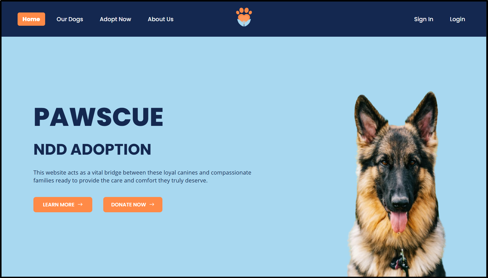

**2. Goals**: Slider defining the goals of the team and the system.

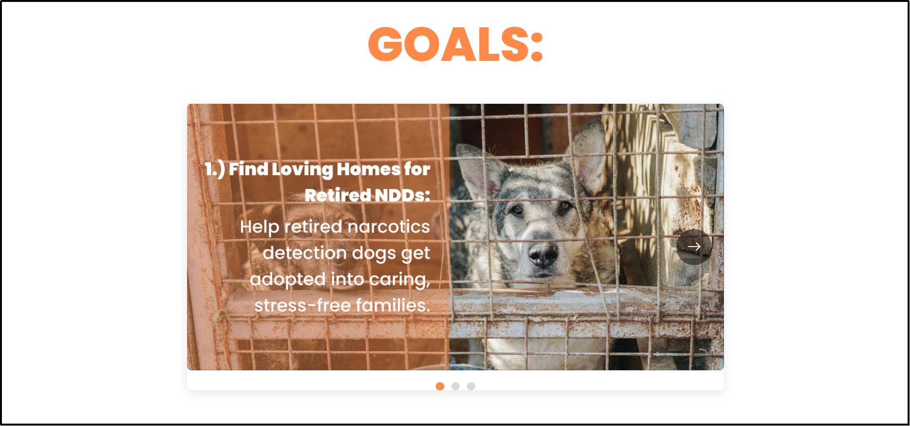

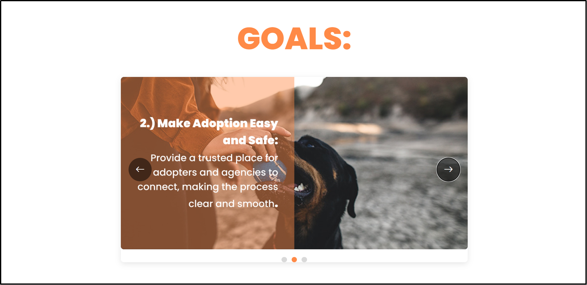

___

### Sign-In and Sign-Up:

**1. Sign-In**: Logging-in with an existing account.

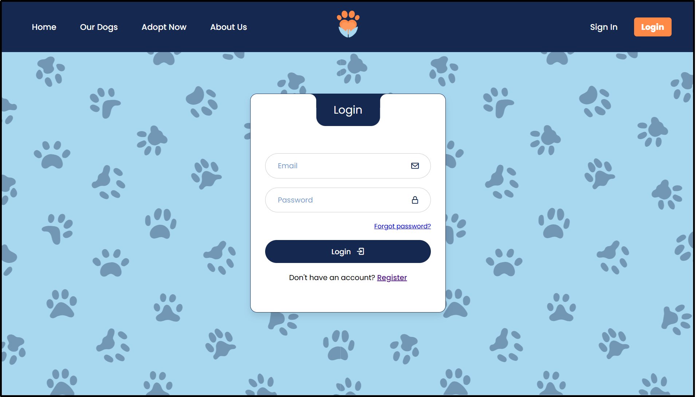

**2. Sign-Up**: Creation of a new account.

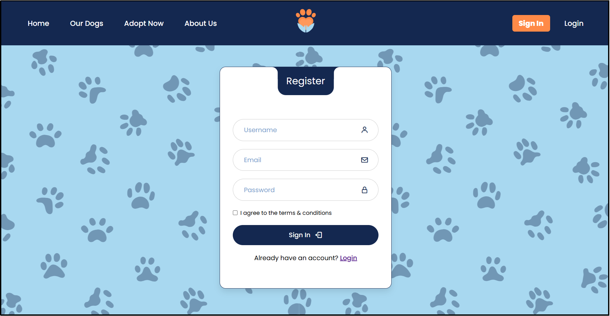

___

### Application Form

**1. Application Form**: Fill-out form for adopter applicants.

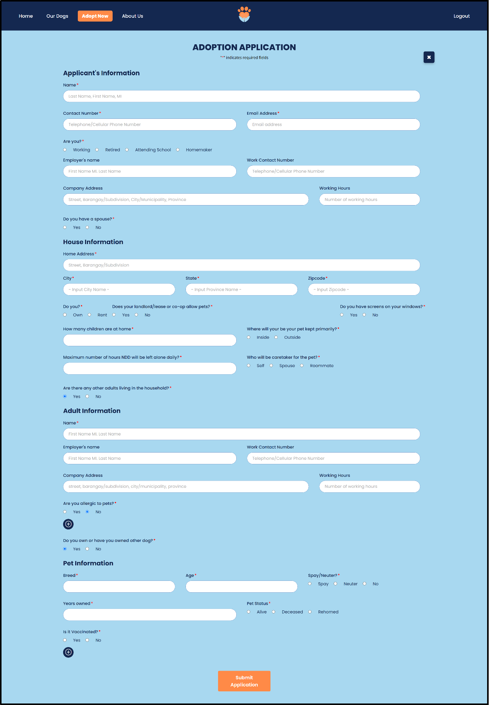

**2. Application Form (View)**: Viewing submitted form.

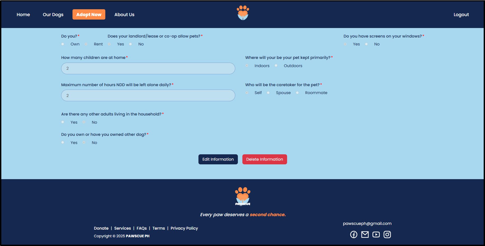

**3. Application Form (Edit)**: Saving application form edits.

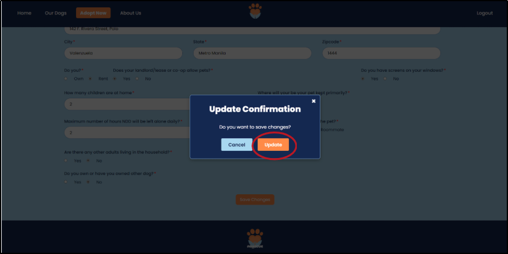

___

### Admin View

**1. Admin Login**: Admin credentials login.
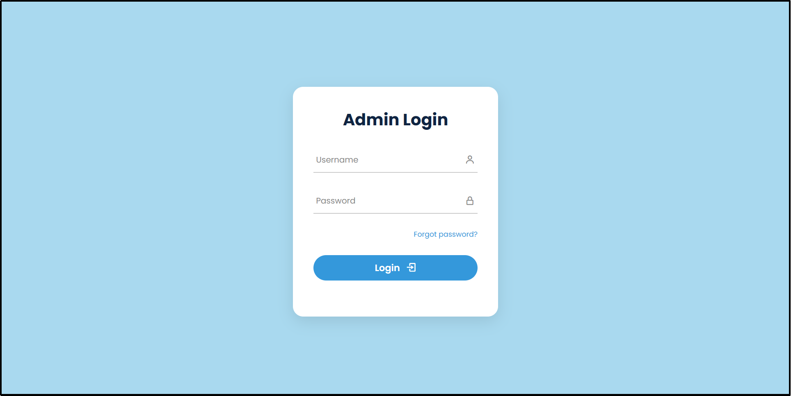

**2. Admin Dashboard**: Tabular view of all submitted applications.
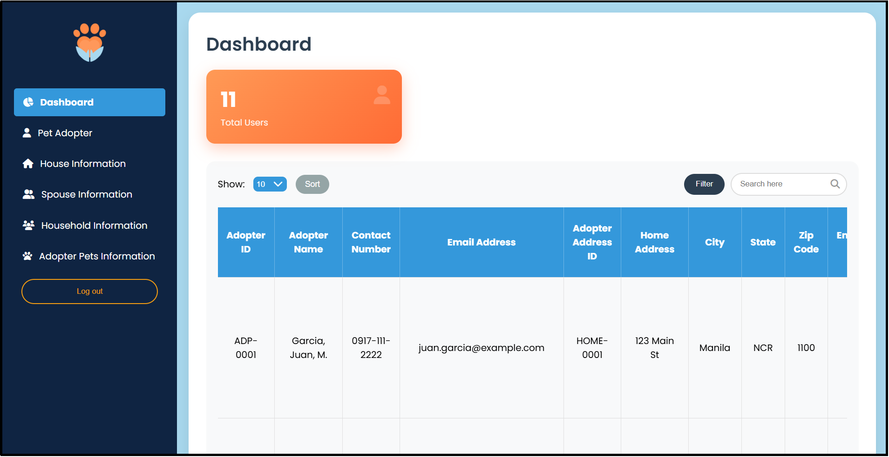

**3. Admin Applications View**: Admin view is divided into separated tabs as how they are separated in the sql-database.
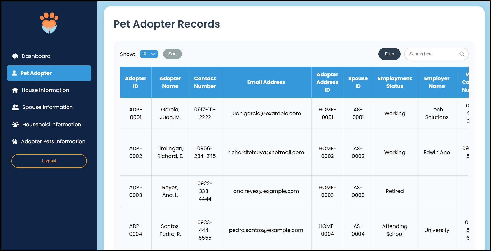

**4. Admin Delete Record**: Admin record/application deletion option.
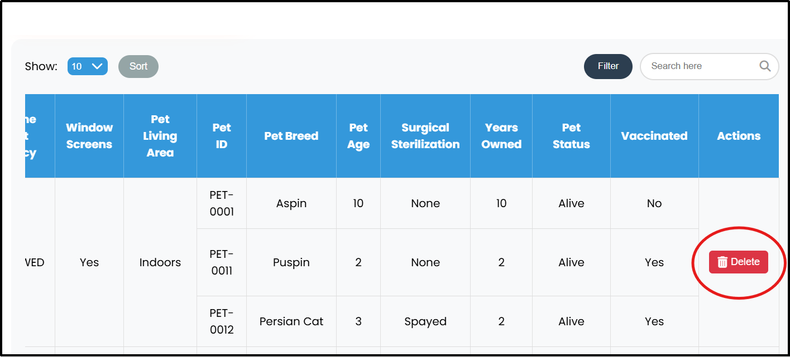

___

_For details regarding application installation and setup. Please view the provided user-manual (**PAWSCUEPH-User-Manual.pdf**)_